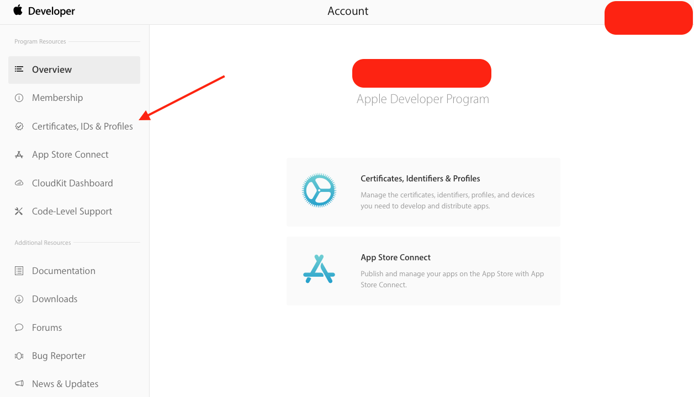
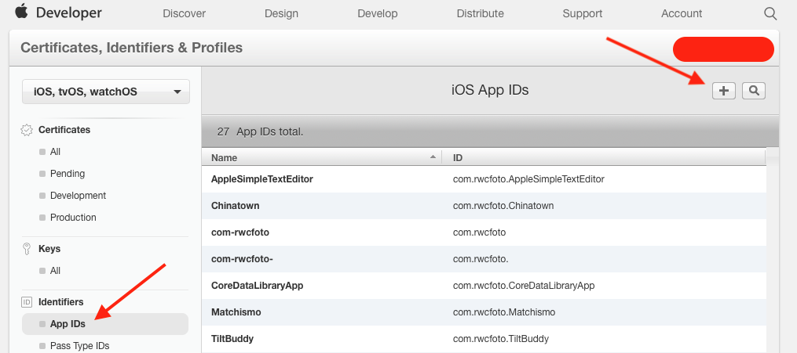
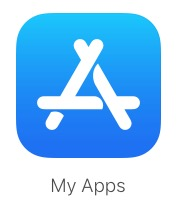
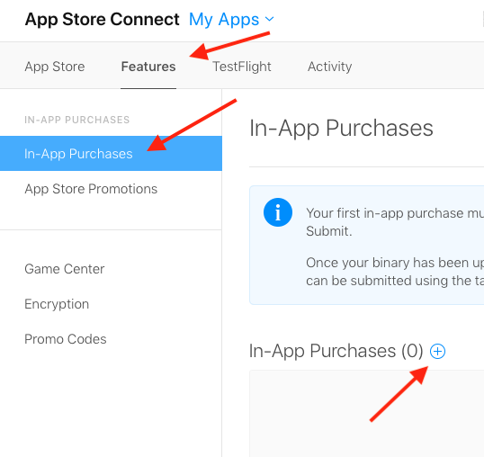
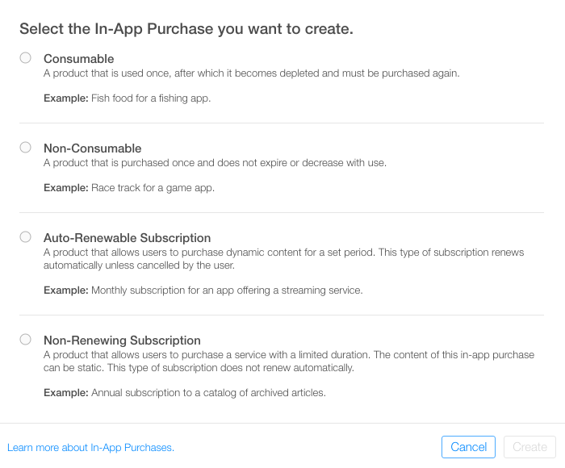
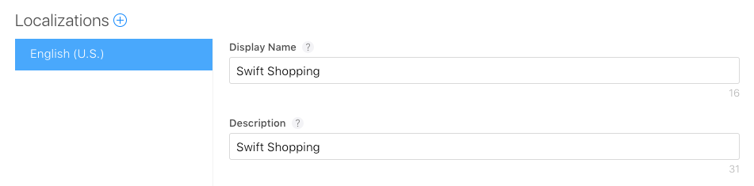
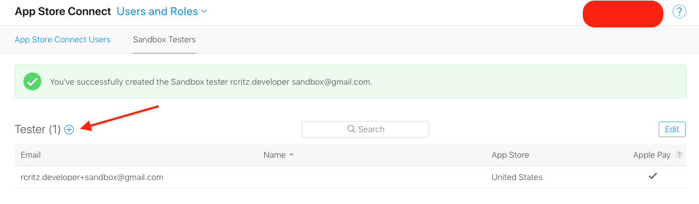
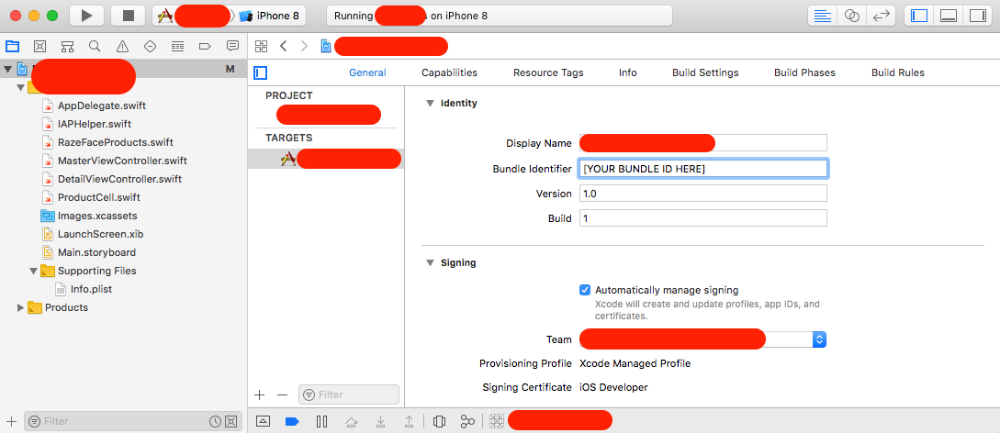
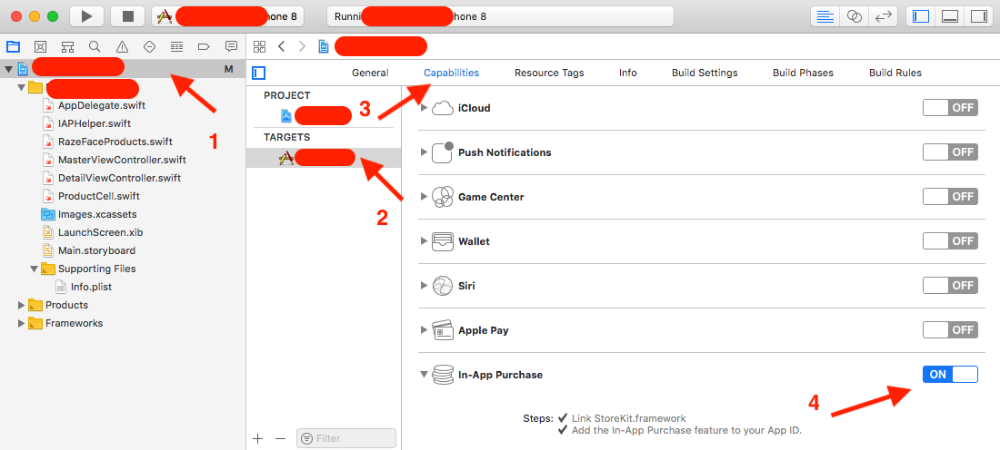

# InAppPurchase-iOS

<h1>Introduction</h1>
INTUZ is presenting an In-App Purchase Sample App Control to integrate inside your native iOS-based application. 
IN-App Purchase is a simple component, which helps you to integrate straight forward method for In-app purchase functions in simple way. By using this demo you can just add the required classes to your project.

  
<h1>Steps</h1>
Before writing any code to incorporate IAP, you’ll first need to do some setup in the iOS Developer Center and App Store Connect.

1. **Creating an App ID** 
    First, you need to create an App ID. This will link together your app to your in-app purchaseable products. Login to the Apple Developer Center, then select Certificates, IDs & Profiles.
    
    

    
    

    
    Next, select Identifiers > App IDs, and click + in the upper right corner to create a new App ID.
    
    

    
    

    
    Fill out the information for the new App ID. Enter IAP Tutorial App for the Name. Choose Explicit App ID and enter a unique Bundle ID. A common practice is to use your domain name in reverse (for example, com.appName.bundle). Make note of the Bundle ID as it will be needed in the steps that follow.

    Scroll down to the App Services section. Notice that In-App Purchase and GameCenter are enabled by default. Click Continue and then Register and Done.

    Congratulations! You have a new App ID! Next, you’ll create a matching app in App Store Connect.
    
2. **Checking Your Agreements**
    Before you can add IAPs to an app in iTunes Connect, you must do two things:

    - Make sure you have accepted the latest Apple Development Program License Agreement on developer.apple.com.
    - Make sure you have accepted the latest Paid Applications agreement in the Agreements, Tax, and Billing section in App Store Connect.
    
3. **Creating an App in iTunes Connect**
    Now to create the app record itself, click App Store Connect in the upper left corner of the page, then click My Apps.

    

    
    

    Next, click + in the upper left corner of the page and select New App to add a new app record.
    You won’t be able to use the exact same app Name that you see here, because app names need to be unique across the App Store. Perhaps add your own initials after the example title shown in the screenshot above.
    
4. **Creating In-App Purchase Products**    
    When offering IAPs you must first add an entry for each individual purchase within App Store Connect. If you’ve ever listed an app for sale in the store, it’s a similar process and includes things like choosing a pricing tier for the purchase. When the user makes a purchase, the App Store handles the complex process of charging the user and reply with data about such operation.

    There are a whole bunch of different types of IAP you can add:

    - Consumable: These can be bought more than once and can be used up. These are a good fit for extra lives, in-game currency, temporary power-ups, and the like.
    - Non-Consumable: Something that you buy once, and expect to have permanently such as extra levels and unlockable content. The illustrations from this tutorial fall into this category.
    - Non-Renewing Subscription: Content that’s available for a fixed period of time.
    - Auto-Renewing Subscription: A repeating subscription such as a monthly raywenderlich.com subscription.
    
    You can only offer In-App Purchases for digital items, and not for physical goods or services. For more information about all of this, check out Apple’s full documentation on Creating In-App Purchase Products.

    Now, while viewing your app’s entry in App Store Connect, click on the Features tab and then select In-App Purchases. To add a new IAP product, click the + to the right of In-App Purchases.

    

    
    

    
    You’ll see the following dialog appear:

    

    
    

    
    When a user purchases a **AppName** in your app, you’ll want them to always have access to it, so select type of IPA, and click Create.
    
    Next, fill out the details for the IAP as follows:

    - Reference Name: A nickname identifying the IAP within iTunes Connect. This name does not appear anywhere in the app. The title of the App you’ll be unlocking with this purchase is Swift Shopping, so enter that here.
    - Product ID: This is a unique string identifying the IAP. Usually it’s best to start with the Bundle ID and then append a unique name specific to this purchasable item. For this tutorial, make sure you append swiftshopping, as this will be used later within the app to look up the AppName to unlock. For example, you can use: com.theNameYouPickedEarlier.type.swiftshopping.
    - Cleared for Sale: Enables or disables the sale of the IAP. You want to enable it!
    - Price Tier: The cost of the IAP. Choose Tier 1.
    
    Now scroll down to the Localizations section and note that there is a default entry for English (U.S.). Enter “Swift Shopping” for both the Display Name and the Description. Click Save. Great! You’ve created your first IAP product.
    
    

    
    

    
    **Note:** App Store Connect may complain that you’re missing metadata for your IAP. Before you submit your app for review, you’re required to add a screenshot of the IAP at the bottom of this page. The screenshot is used only for Apple’s review and does not appear in your App Store listing.
    
    There’s one more step required before you can delve into some code. When testing in-app purchases in a development build of an app, Apple provides a test environment which allows you to “purchase” your IAP products without creating financial transactions.

    These special test purchases can only be made by a special “Sandbox Tester” user account in App Store Connect. You’re almost at the code, I promise!
    
5. **Creating a Sandbox User**
    In App Store Connect, click App Store Connect in the top left corner of the window to get back to the main menu. Select Users and Roles, then click the Sandbox Testers tab. Click + next to the “Tester” title.
    
    

    
    

    
    Fill out the information and click Save when you’re done. You can make up a first and last name for your test user, but you must use a real email address as Apple will send a verification email to the address. Once you receive that email, be sure to click the link in it to verify your address.
    
    The email address you enter should also NOT already be associated with an Apple ID account. Hint: if you have a gmail account, you can simply use an address alias instead of having to create a brand new account.
    
6. **Project Configuration**
    For everything to work correctly, it’s really important that the bundle identifier and product identifiers in the app match the ones you just created in the Developer Center and in App Store Connect.

    Head over to the starter project in Xcode. Select the **AppName** project in the Project navigator, then select it again under Targets. Select the General tab, switch your Team to your correct team, and enter the bundle ID you used earlier.
    
    

    
    

    
    Next select the Capabilities tab. Scroll down to In-App Purchase and toggle the switch to ON.
    
    **Note:** If IAP does not show up in the list, make sure that, in the Accounts section of Xcode preferences, you are logged in with the Apple ID you used to create the app ID.
    
    

    
    

    
  
<h1>Getting Started</h1>

To use this component in your project you need to perform the below steps:

> **Steps to Integrate**

1) Add `AppDelegate+Subscription.swift` at the required place on your code.

2) Add `pod 'SwiftyStoreKit'` and `pod 'SwiftyJSON'` 
In the podfile and Open Terminal to pod install. 

You have to add `ProductID` and `Shared Secret` in your AppDelegate or in Constant Class.

3) Now, you can add the code that written in the `ViewController.swift` to your `SubscriptionVC.swift` class. Add 2 button in the storyboard for Subsctioption and Restore as the requirement. 

**Note:** Make sure that the extension which is used in this component has been added to your project. 

  
**<h1>Bugs and Feedback</h1>**
For bugs, questions and discussions please use the Github Issues.

  
**<h1>License</h1>**
The MIT License (MIT)
  
Copyright (c) 2020 INTUZ
  
Permission is hereby granted, free of charge, to any person obtaining a copy of this software and associated documentation files (the "Software"), to deal in the Software without restriction, including without limitation the rights to use, copy, modify, merge, publish, distribute, sublicense, and/or sell copies of the Software, and to permit persons to whom the Software is furnished to do so, subject to the following conditions: 
  
THE SOFTWARE IS PROVIDED "AS IS", WITHOUT WARRANTY OF ANY KIND, EXPRESS OR IMPLIED, INCLUDING BUT NOT LIMITED TO THE WARRANTIES OF MERCHANTABILITY, FITNESS FOR A PARTICULAR PURPOSE AND NONINFRINGEMENT. IN NO EVENT SHALL THE AUTHORS OR COPYRIGHT HOLDERS BE LIABLE FOR ANY CLAIM, DAMAGES OR OTHER LIABILITY, WHETHER IN AN ACTION OF CONTRACT, TORT OR OTHERWISE, ARISING FROM, OUT OF OR IN CONNECTION WITH THE SOFTWARE OR THE USE OR OTHER DEALINGS IN THE SOFTWARE.

 
<h1></h1>

